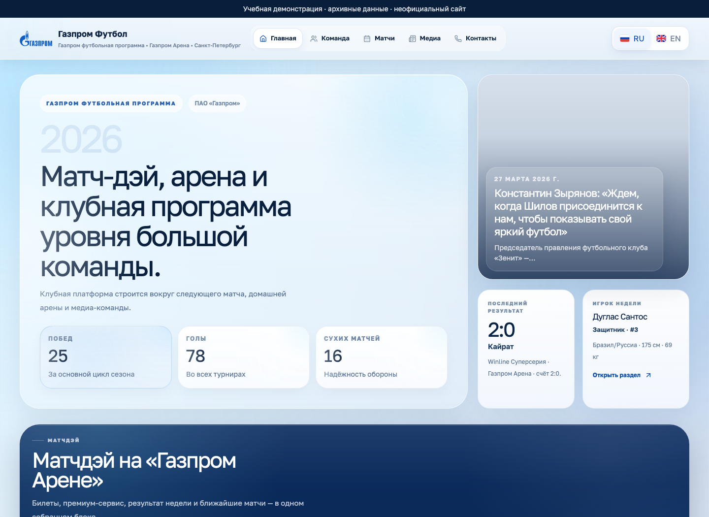
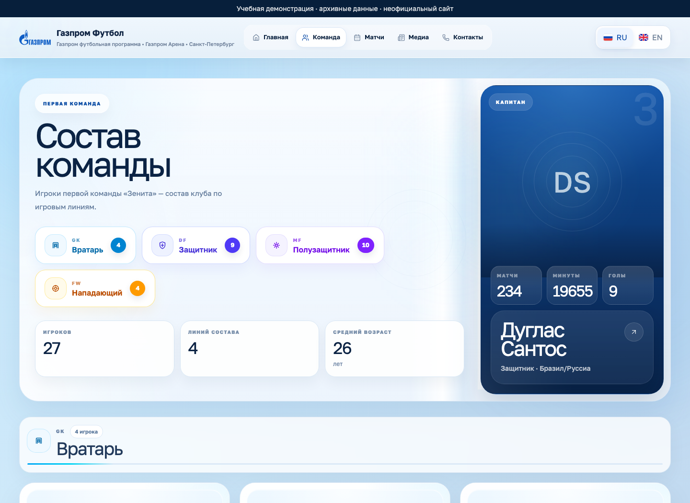
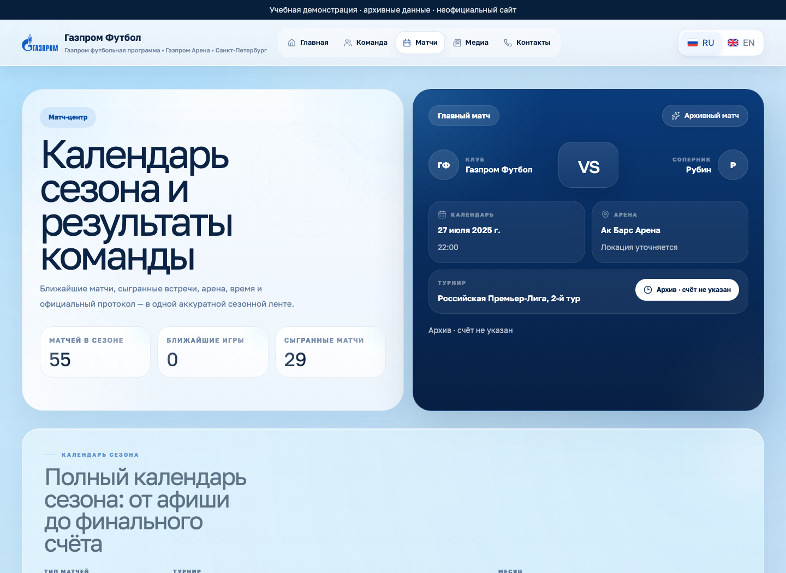
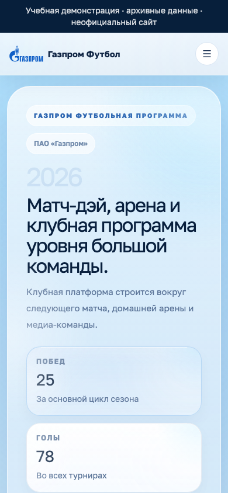

<div align="center">
  
  <h1>FootballGroup</h1>
  <p><strong>Сайт футбольного клуба как учебный проект</strong></p>
  <p>Django, React, PostgreSQL и Celery: от состава команды<br>и календаря матчей до управления контентом и кэширования.</p>
  <p>
    <a href="https://github.com/nickihysterics/FootballGroup-WebSite/actions/workflows/ci.yml"></a>
    
    
    
    <a href="LICENSE"></a>
  </p>
  <p><a href="#быстрый-старт">Запустить</a> · <a href="#демонстрация">Демонстрация</a> · <a href="docs/architecture.md">Архитектура</a> · <a href="https://github.com/nickihysterics/FootballGroup-WebSite/releases">Релизы</a></p>
</div>



## О проекте

**FootballGroup** — учебно-демонстрационный сайт футбольного клуба с публичными страницами, RU/EN интерфейсом, Django Admin и JSON API. На его примере можно разобрать серверные шаблоны, SPA-навигацию, двуязычный контент, реляционные данные, кэш и фоновые задачи.

Проект сохраняет визуальный стиль исходной работы «Газпром Футбол». **Сайт неофициальный**: название, эмблема и историческое наполнение используются для демонстрации. Матчи, биографии и публикации — архивный снимок исходной работы; приложение не получает актуальные результаты соревнований и не продаёт билеты. Эти границы обозначены в самом интерфейсе.

## Возможности

| Раздел | Что доступно |
| --- | --- |
| Главная | Сводные показатели, матч, игроки, новости, клубная программа и 3D-сцена |
| Команда | Группы по позициям, карточки игроков, капитан и отдельные профили |
| Матчи | Календарь, результаты, фильтры по типу, турниру и месяцу |
| Медиа | Новости и галерея на базе импортированного контента |
| Контакты | Демонстрационные контакты, сведения об арене и внешняя ссылка на карту |
| Управление | Django Admin для клуба, игроков, матчей, публикаций, галереи и достижений |
| Локализация | RU/EN, сохранение выбора языка и fallback отсутствующего перевода |
| Доставка | SQLite для простого запуска; полный Docker-стек с PostgreSQL, Redis и Celery |

| Состав команды | Архив матчей |
| --- | --- |
|  |  |

<details>
<summary>Мобильная версия</summary>
<p align="center"></p>
</details>

## Быстрый старт

Нужны **Python 3.11–3.13** и Git. Для просмотра готового интерфейса Node.js не требуется: сборка включена в репозиторий.

```bash
git clone https://github.com/nickihysterics/FootballGroup-WebSite.git
cd FootballGroup-WebSite
python -m venv .venv
```

Активируйте окружение:

```bash
# macOS / Linux
source .venv/bin/activate
```

```powershell
# Windows PowerShell
.venv\Scripts\Activate.ps1
```

Установите зависимости и запустите сайт:

```bash
python -m pip install -r requirements.txt
python manage.py migrate
python manage.py seed_demo
python manage.py runserver 127.0.0.1:8000
```

Откройте [сайт](http://127.0.0.1:8000/). Этот режим использует SQLite и кэш в памяти; PostgreSQL, Redis и Celery запускать не нужно. Остановка — `Ctrl+C`.

Для админки создайте собственную учётную запись:

```bash
python manage.py createsuperuser
```

Вход: [Django Admin](http://127.0.0.1:8000/admin/). Предустановленного логина и пароля нет.

### Docker

Нужен Docker с Compose. Из корня проекта:

```bash
python scripts/setup_demo.py
docker compose up --build --wait
```

Откройте [localhost:8000](http://localhost:8000/). Скрипт создаёт `.env` со случайными локальными секретами; существующий файл сохраняется. Compose поднимает PostgreSQL, Redis, Django/Gunicorn, Nginx, Celery worker и Celery Beat.

```bash
docker compose exec web python manage.py createsuperuser
docker compose logs -f web
docker compose down
```

Веб-процесс работает от непривилегированного пользователя. Порт привязан к `127.0.0.1`, база и Redis наружу не публикуются. Данные базы и загруженные изображения сохраняются в именованных томах после обычного `down`. Команда `docker compose down -v` удаляет эти данные.

Если порт занят, добавьте `FOOTBALL_PORT=8001` в `.env` и повторите запуск. Сайт будет доступен на `http://127.0.0.1:8001/`.

## Демонстрация

1. Откройте главную страницу, покажите сводные данные и архивный статус контента.
2. Перейдите в «Команду», откройте игрока и обновите страницу: прямые ссылки обслуживаются Django.
3. Переключите RU/EN и сравните названия, даты и биографии.
4. Откройте «Матчи», примените фильтр турнира или месяца.
5. Создайте администратора, измените игрока и обновите публичную страницу.
6. Разберите `/api/team/` и сопоставьте JSON с React-компонентом.
7. В Docker выполните задачу Celery и сравните кэшированный матч-хаб с данными базы.

[Архитектура и задания для разбора](docs/architecture.md) · [Разработка и проверки](docs/development.md)

## Стек и структура

| Слой | Технологии |
| --- | --- |
| Сервер | Django 5.2, Gunicorn, WhiteNoise |
| Интерфейс | React 18, Vite 7, React Router, Tailwind CSS 4 |
| Визуализация | Three.js и React Three Fiber |
| Данные | SQLite / PostgreSQL, локальный JSON-снимок |
| Кэш и очередь | Redis, Celery, Celery Beat |
| Инфраструктура | Docker Compose, Nginx, GitHub Actions |

```text
club/                 модели, payloads, API, админка, импорт, задачи и тесты
config/               настройки Django, маршруты, WSGI/ASGI и Celery
webapp/src/           React: страницы, виджеты, UI и локализация
webapp/tests/         тесты кэша, HTTP-клиента и статусов матчей
static/dist/          готовый интерфейс и локальные шрифты
templates/            HTML-каркас, начальный JSON и fallback
data/                 исторический демонстрационный снимок
infra/nginx/          конфигурация локального reverse proxy
scripts/              подготовка .env и браузерная проверка
docs/                 архитектура, аудит копий, лицензии и скриншоты
```

Django отдаёт HTML с начальными данными через `json_script`. React монтируется в каркас и получает последующие страницы через API. При отключённом JavaScript доступен упрощённый серверный вариант; интерактивные фильтры и 3D требуют JavaScript.

## API

Публичные endpoints доступны без авторизации и принимают только чтение:

| Endpoint | Ответ |
| --- | --- |
| `/health/` | Доступность базы и версия приложения |
| `/api/site/` | Профиль клуба |
| `/api/home/` | Данные главной страницы |
| `/api/team/` | Игроки, капитан и группы состава |
| `/api/matches/` | Календарь и матч-хаб |
| `/api/media/` | Новости и галерея |
| `/api/contacts/` | Контакты, каналы и последние матчи |

```bash
curl http://127.0.0.1:8000/health/
curl http://127.0.0.1:8000/api/team/
```

Редактирование выполняется через авторизованную админку. JSON-ответы сохраняют поля `_ru` и `_en`; нужный язык выбирается клиентом. Профиль игрока: `/team/<slug>/`, неизвестный slug возвращает `404`.

## Демо-данные и импорт

Снимок находится в `data/reference_snapshot.json`: 27 игроков, 55 матчей, 5 новостей и 5 элементов галереи, а также профиль клуба и достижения. Внешние фотографии в поставляемом снимке отключены. Шрифты входят в сборку, поэтому после установки зависимостей демонстрация не требует внешнего API или CDN; ссылки на карты остаются внешними.

```bash
# Заполнить только пустую базу
python manage.py seed_demo

# Обновить записи снимка, сохранив посторонние записи
python manage.py sync_reference_snapshot

# Явно заменить содержимое таблиц контента
python manage.py sync_reference_snapshot --replace
```

Импорт выполняется в транзакции. Ошибка не оставляет частично очищенную базу. Режим обновления может изменить совпадающие записи по ключам — для сохранения собственных правок используйте обычный `seed_demo` или отредактируйте сам снимок.

## Настройки

| Переменная | Поведение |
| --- | --- |
| `DJANGO_DEBUG` | По умолчанию `True` для локального запуска; Docker использует `False` |
| `DJANGO_SECRET_KEY` | Обязательна при `DEBUG=False`, минимум 50 символов |
| `DJANGO_ALLOWED_HOSTS` | Разрешённые имена хостов через запятую |
| `SQLITE_PATH` | Собственный путь к SQLite-файлу |
| `POSTGRES_*` | Подключение к PostgreSQL; наличие `POSTGRES_DB` переключает backend |
| `REDIS_URL` | Общий кэш; без значения используется память процесса |
| `CELERY_BROKER_URL`, `CELERY_RESULT_BACKEND` | Очередь и результаты задач |
| `DJANGO_SEED_DEMO` | Импорт в пустую базу при Docker bootstrap |
| `FOOTBALL_PORT` | Порт локального Nginx в Compose |

`.env` читает Docker Compose. При обычном запуске Python настройки берутся из переменных окружения; локальный `.env` автоматически не загружается.

## Проверки

```bash
python -m pip install -r requirements-dev.txt
python manage.py collectstatic --noinput
python manage.py test
npm ci --prefix webapp
npm test --prefix webapp
npm run build --prefix webapp
python -m playwright install chromium
python scripts/check_browser.py
```

CI проверяет сервер на Linux, Windows и macOS, сборку React, браузерный сценарий и Docker с PostgreSQL/Celery. [Полные команды, покрытие и диагностика](docs/development.md).

Среди регрессионных проверок: откат ошибочного импорта, сохранение пользовательских данных при seed, повторяемый импорт, прямые ссылки на игроков, отказ кэша и отмена одного подписчика общего HTTP-запроса.

## Репозиторий и лицензия

Репозиторий переименован из `py-FootballGroupWebsite` в **FootballGroup-WebSite**. [Аудит исходных копий](docs/repository-audit.md) объясняет различия локальной папки, ZIP и прежнего GitHub-состояния.

Код распространяется по [MIT](LICENSE). Бренды, историческое наполнение и шрифты имеют отдельные условия: [сторонние компоненты](THIRD_PARTY_NOTICES.md). [История версии](CHANGELOG.md) · [Участие](CONTRIBUTING.md)
